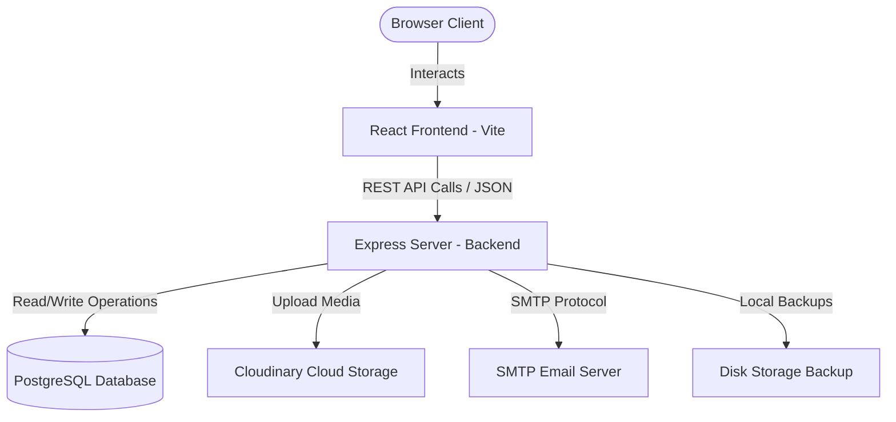

# 🧸 MyFluffy Shop — Fullstack E-Commerce Workspace

Welcome to the **MyFluffy Shop** monorepo! This workspace houses a complete e-commerce platform designed for selling and managing adorable soft toys. The system features a modern decoupled architecture consisting of an Express-based REST API, a PostgreSQL database, a Cloudinary media cloud, and a React + Vite frontend application.

---

## 🗂️ Project Structure

This workspace is organized into a modular structure to separate the frontend UI representation from the backend core APIs:

```
MyFluffy-Shop-1/
├── ⚙️ Backend/                  # Express REST API (Sequelize + PostgreSQL)
│   ├── src/                    # Application source code
│   │   ├── config/             # Database and config files
│   │   ├── controllers/        # Request controllers (website & admin)
│   │   ├── middleware/         # Security and auth middlewares
│   │   ├── models/             # Sequelize database models
│   │   ├── routes/             # Route configurations
│   │   └── utils/              # Cron jobs, logging, and helpers
│   ├── tests/                  # Integration and unit tests
│   └── seed.js                 # Seeding script for initial data
│
├── 🎨 Frontend/MyFluffy/        # React Web Application (Vite + CSS)
│   ├── src/
│   │   ├── component/          # UI components (Shop, Cart, checkout, Admin dashboard)
│   │   ├── context/            # Context API states (CartContext, AuthContext)
│   │   └── style/              # Modular Vanilla CSS stylesheets
│   └── index.html              # HTML Entrypoint
│
├── package.json                # Root workspaces & orchestration script
└── README.md                   # Workspace documentation (this file)
```

---

## 🛠️ Technology Stack Overview

### 1. Unified Integration Orchestrator (Root)
* **Package Manager**: npm
* **Execution Utilities**: `concurrently` (runs Frontend and Backend simultaneously)
* **Package Architecture**: DEC (Decoupled Multi-Package Workspace)

### 2. Core API Backend (`/Backend`)
* **Framework**: Express.js (ES Modules syntax)
* **Database & ORM**: PostgreSQL database connected via Sequelize ORM
* **Security & Optimization**: Helmet headers, CORS, Express-Rate-Limit
* **Authentication**: JSON Web Tokens (JWT) & BcryptJS hashing
* **Media Handling**: Multer combined with Cloudinary Storage for image uploads
* **Cron Workloads**: Node-Cron for system automated backups
* **Documentation**: Swagger JSDoc + Swagger UI Express (available at `/api-docs`)
* **Mailing**: Nodemailer (SMTP server connection)
* **Testing Framework**: Jest and Supertest (mocking API integrations)

### 3. Client Frontend (`/Frontend/MyFluffy`)
* **Build Engine**: Vite (v8) + React (v19)
* **API Communication**: Axios client instance
* **Styling**: Vanilla CSS for bespoke modular animations and control
* **State Management**: React Context API (`AuthContext` for sessions, `CartContext` for cart state)
* **Iconography**: Lucide React

---

## 🚀 Getting Started (Combined Setup)

To run the entire ecosystem locally with a single terminal command, make sure you have:
1. **Node.js** (v18 or higher recommended)
2. **npm** (v9 or higher)
3. **PostgreSQL** server running locally or hosted on the cloud

### Step 1: Clone and Enter Directory
```bash
cd MyFluffy-Shop-1
```

### Step 2: Configure Environment Variables
You must set up the backend environment variables before launching the services. 
Create a `.env` file inside the `Backend/` directory:
```bash
cp Backend/.env.example Backend/.env # or manually copy key contents
```
*(See [Backend README](file:///d:/MY%20project/MyFluffy-Shop-1/Backend/README.md) for full configuration details).*

### Step 3: Install Dependencies for All Parts
The root package contains a script to install all packages for the workspace, backend, and frontend at once:
```bash
npm run install-all
```

### Step 4: Run the Complete System
Start both the Express API and React Frontend dev server concurrently:
```bash
npm run dev
```

* **Backend Dev Server**: [http://localhost:3000](http://localhost:3000)
* **API Documentation**: [http://localhost:3000/api-docs](http://localhost:3000/api-docs)
* **Frontend Application**: [http://localhost:5173](http://localhost:5173) (Vite default port)

---

## 🧪 Documentation & Testing

* **Backend Specifications**: Full details on API routes, database schemas, database seeding, and testing can be found in the [Backend README](file:///d:/MY%20project/MyFluffy-Shop-1/Backend/README.md).
* **Frontend Specifications**: Full details on component breakdown, contexts, and styling guidelines can be found in the [Frontend README](file:///d:/MY%20project/MyFluffy-Shop-1/Frontend/MyFluffy/README.md).

---

## 📐 Architecture Flow


